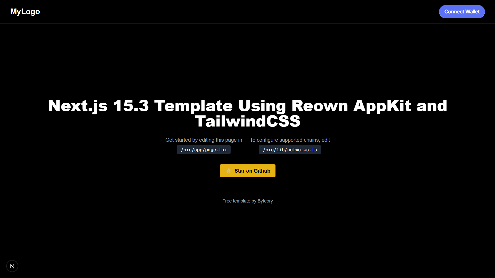
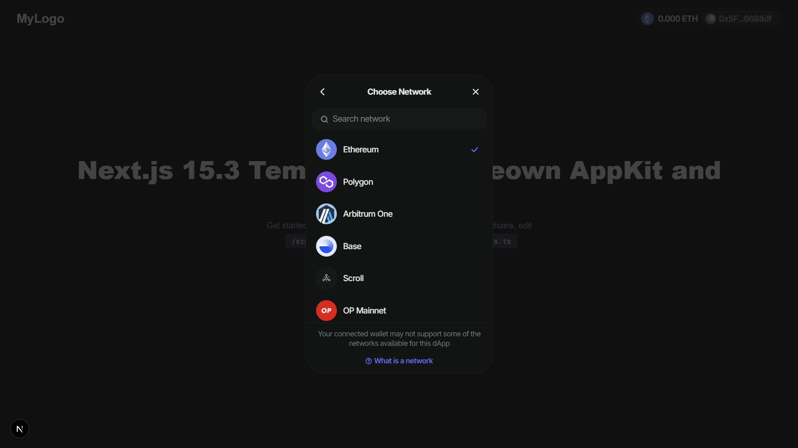

# 🧪 Next.js 15.3 Web3 Starter Template

A sleek starter template built with **Next.js 15.3**, **Reown AppKit**, **Wagmi**, **Tailwind CSS**, and **TypeScript** — ideal for modern Web3 dApps.

> 🔥 Perfect for wallet connection, EVM chain support, and rapid UI customization.

## 🖼️ Preview





---

## 🚀 Tech Stack

* **Next.js 15.3 (App Router)**
* **Reown AppKit** – Wallet connect modal
* **Wagmi + Viem** – Web3 hooks
* **Tailwind CSS** – Utility-first styling
* **TypeScript** – For type safety

---

## 📂 File Structure

```
src/
├─ app/          → App Router structure
│  └─ page.tsx   → Main UI page
├─ lib/          → Configuration files
├─ providers/    → React providers
└─ components/   → Add your UI components here
```

---

## 🔧 Configuration

### Environment Variables

Create a `.env` file in the root directory with the following:

```
NEXT_PUBLIC_WALLETCONNECT_PROJECT_ID=your_project_id_here
```

### Supported Chains

To modify supported chains, edit:

```typescript
// src/lib/networks.ts
export const networks = [
  mainnet,
  polygon,
  arbitrum,
  base,
];
```

To start customizing, edit:

```
/src/app/page.tsx
```

---

💡 **Features**

* Wallet connection (MetaMask, WalletConnect, etc.)
* Clean, dark theme-ready layout
* Easily extendable for any Web3 use case

---

📦 **Getting Started**

```bash
npm install
# or
yarn install

npm run dev
# or
yarn dev
```

---

⭐ **Credits**
Free template by [Byteory](https://byteory.com)

Don't forget to 🌟 the repo if you found it useful!

---

📜 **License**
MIT — free to use and modify.
